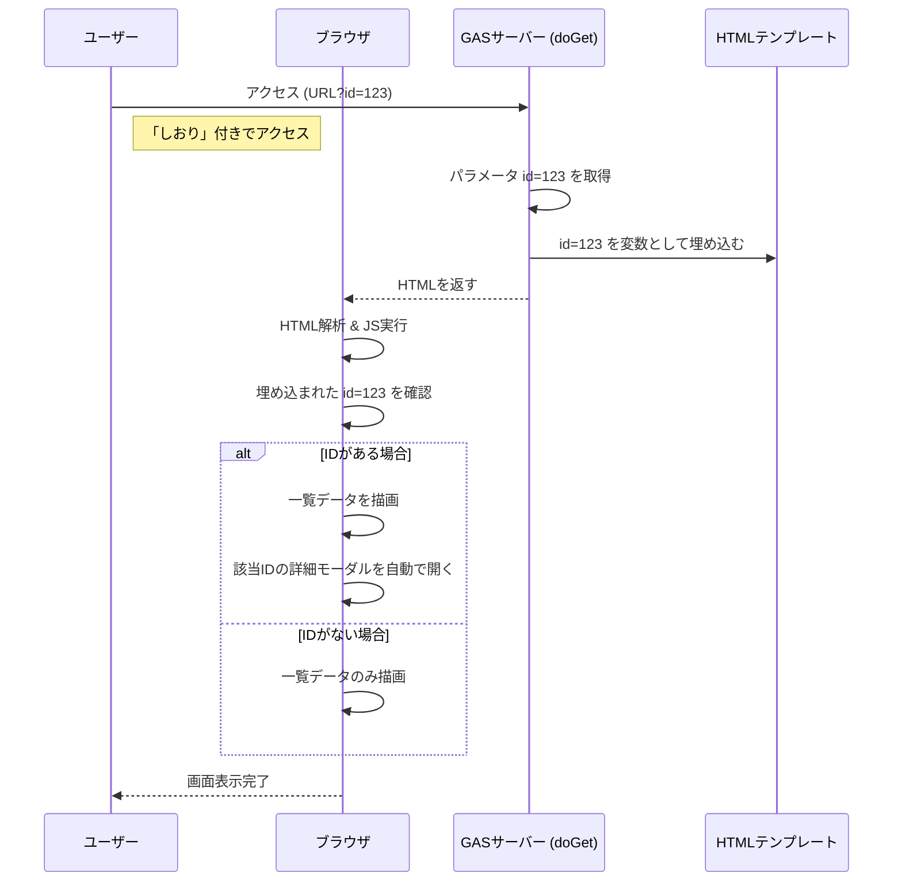

# GAS WebアプリにおけるURLルーティング（Deep Linking）の実現方法

このドキュメントでは、AI Knowledge Dashboardで実装された「特定の記事を直接開くURL」の仕組みについて解説します。

Google Apps Script (GAS) で作られたWebアプリは、通常1つのURLしか持ちませんが、工夫することで「詳細ページへの直接リンク」を実現できます。

## 1. 概要：やりたいことと解決策

### やりたいこと
通常、GASのアプリにアクセスすると、常に「トップページ（一覧）」が表示されます。
しかし、**「この記事面白いよ！」とチャットで共有したいとき、クリック一発でその記事が開いた状態で表示されてほしい** ですよね。

### 解決策： 「しおり」を挟んで渡す
この仕組みは、本に「しおり」を挟んで友達に渡すのと似ています。

1.  **しおりを挟む**: 記事を開いたとき、URLの末尾に `?id=123` という「しおり（パラメータ）」をこっそり付けます。
2.  **しおりを見る**: そのURLでアクセスされたとき、システムは「お、しおりが挟まっているな」と気づきます。
3.  **ページを開く**: システムはトップページを表示した直後に、自動的にそのページ（詳細モーダル）を開きます。

---

## 2. 仕組みの解説（エンジニア向け概要）

GASのWebアプリは `iframe` 内で動作するため、通常のWebサイトのようにURLパス（`/articles/123`）を使ったルーティングはできません。
代わりに **クエリパラメータ (`?id=123`)** と **サーバーサイドレンダリング (SSR) 風のデータ渡し** を組み合わせて実現します。

### 処理の流れ



### 重要なポイント
1.  **サーバー側での受け取り**: GASの `doGet(e)` 関数は、URLパラメータを `e.parameter` として受け取ることができます。
2.  **HTMLへの埋め込み**: 受け取ったIDを、HTML生成時にJavaScriptの変数として埋め込みます（`const SERVER_DATA = { initialId: 123, ... }`）。
3.  **クライアント側での制御**: ページ読み込み完了時 (`window.onload`) にこの変数をチェックし、値があればモーダルを開く関数を実行します。

---

## 3. 実装詳細（本プロジェクトでの実装）

実際のコードベース (`src/Code.ts`, `src/index.html`) での実装方法を解説します。

### 3.1 サーバーサイド (`src/Code.ts`)

`doGet` 関数でパラメータを取得し、テンプレートオブジェクトのプロパティとして渡します。

```typescript:src/Code.ts
function doGet(e: GoogleAppsScript.Events.DoGet): GoogleAppsScript.HTML.HtmlOutput {
  const template = HtmlService.createTemplateFromFile('index');

  // 1. URLパラメータからIDを取得
  // 例: .../exec?id=5 なら "5" が取れるので数値に変換
  const id = e.parameter.id ? parseInt(e.parameter.id) : null;
  
  // 2. テンプレート変数にセット
  // nullの場合でも安全に扱えるように渡す
  (template as any).initialId = id;

  // アプリ自体のURLも取得して渡す（共有リンク作成用）
  try {
    (template as any).appUrl = ScriptApp.getService().getUrl();
  } catch (e) {
    (template as any).appUrl = '';
  }

  // ... (その他の初期データ取得) ...

  return template.evaluate(); // HTMLを生成
}
```

### 3.2 HTMLテンプレートへの埋め込み (`src/index.html`)

GASのテンプレート構文（スクリプトレット）を使って、HTML内の `<script>` タグにJavaScriptのオブジェクトとして出力します。
**注意点**: 直接値を埋め込むとエスケープの問題や構文エラーが起きやすいため、一度グローバル変数 `SERVER_DATA` にまとめる方式を採用しています。

```html:src/index.html
<body>
  <!-- サーバーサイドからの変数をグローバル変数として定義 -->
  <script>
    const SERVER_DATA = {
      // データそのもの (JSON)
      initialData: <?!= initialData ?>,
      // ID (数値またはnull)
      // テンプレート評価時にnullが文字列にならないよう三項演算子で制御
      initialId: <?= initialId !== null ? initialId : 'null' ?>,
      // アプリURL (文字列)
      appUrl: "<?!= appUrl ?>"
    };
  </script>
  
  <!-- ... コンコンテンツ ... -->
</body>
```

### 3.3 クライアントサイドでの制御 (`src/index.html`)

ページ読み込み時に `SERVER_DATA.initialId` を確認し、モーダルを開きます。

```javascript:src/index.html
window.onload = function () {
  // 1. サーバーから渡されたIDを取得
  let initialId = SERVER_DATA.initialId;
  
  // (補足) サーバー渡しがない場合、URLパラメータから直接取るフォールバック処理も実装
  if (initialId === null) {
     const urlParams = new URLSearchParams(window.location.search);
     if (urlParams.has('id')) initialId = parseInt(urlParams.get('id'));
  }

  // 2. データ描画とモーダル展開
  const initialData = SERVER_DATA.initialData;
  if (initialData) {
    displayKnowledge(initialData); // 一覧を描画

    // IDが指定されている場合、詳細モーダルを開く
    if (initialId) {
      // 重要: 描画処理との競合を防ぐため、わずかに遅延させる
      setTimeout(() => {
        showDetail(initialId, false); // false = URL履歴を追加しない
      }, 100);
    }
  }
};
```

### 3.4 共有リンクの生成と履歴管理

ユーザーが画面上で操作したときもURL（内部的な履歴）を更新します。これにより「ブラウザの戻るボタン」が機能します。

*   **モーダルを開く時**: `history.pushState({id: 123}, '', '?id=123')` を実行。
*   **共有リンクコピー時**: `SERVER_DATA.appUrl` + `?id=123` の文字列を生成してクリップボードにコピー。

## まとめ

この実装により、**「SPAのような快適な操作性」** と **「特定の情報を共有できる利便性」** を両立しています。
GASの制約（iframe内動作、サーバーサイドの特殊性）を回避するための工夫（`setTimeout`、テンプレート変数の渡し方など）が重要なポイントです。

