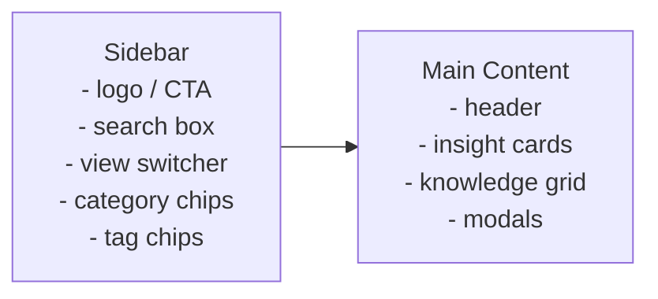

# UI Layout Overview

2カラム構成の Notion ライク UI について、主要コンポーネントと振る舞いをまとめる。実装詳細は `src/index.html` を参照。

## 1. Layout Structure

- **Sidebar**: 固定 300px。検索、ビュー（ホーム/お気に入り）、カテゴリ、タグをまとめ、左カラムだけでフィルタが完結するようにした。
- **Main Content**: ヘッダー + インサイトカード + カードグリッドの順に並べ、視線を上→下に流しやすい構成。

## 2. Components

- **Search / Filters**:
  - キーワード検索は `searchKnowledge` で即時フィルタ。
  - ビュー切り替え（全件/お気に入り）・カテゴリ切り替えは state (`currentView`, `selectedCategory`) を更新し `filterKnowledge` へ集約。
  - タグチップはクリックで `selectedTags` をトグル。

- **Insight Cards** (`Total entries`, `Favorites`, `Comments`):
  - `updateInsights` で `allKnowledge` とローカル state をもとに再計算。

- **Knowledge Card**:
  - カバービジュアル（任意）、カテゴリバッジ、ステータス Pill、要約テキスト、タグ、いいねボタンを含む。
  - いいねは LocalStorage に保存した `clientId`/`likedIds` を用いた楽観更新。

- **Modals**:
  - 詳細モーダルではカテゴリ/ステータス/URL/Markdown 描画/コメント/いいね/共有/編集をまとめて表示。
  - 追加/編集モーダルは従来のフォームを流用しつつ、今後カテゴリ固有メタデータ拡張を予定。

## 3. Interactions

- `filterKnowledge()` が検索/カテゴリ/タグ/ビュー/お気に入りフィルタを一括で適用し、`renderKnowledgeGrid` に渡す。
- コメント・いいねは楽観的 UI → サーバー応答後に `loadKnowledge` or state 更新を行う。
- `updateCategoryUI` / `updateViewUI` でサイドバーのボタン状態を同期。

## 4. Next Enhancements

- EasyMDE などの Markdown エディタ導入（フォーム限定）。
- タグオートコンプリート UI、カテゴリ固有項目に応じたフォーム切替。
- Insight Cards を可変化してカテゴリ別メトリクスやトレンドカードを追加。

この概要は README の Documentation セクションからリンクされ、UI 改修の背景を共有するための簡潔なハブとなる。
