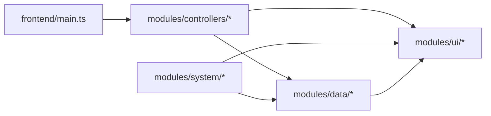

# Repository Structure

AI Knowledge Dashboard のリポジトリ構成と、今回のフロントエンド分割後の責務をまとめる。設計や実装の詳細は各ディレクトリ配下のコードを参照し、このドキュメントでは「どこに何があるか」を素早く把握できることを目的にしている。

## Top-Level Layout

| Path | Role |
| --- | --- |
| `README.md` | プロジェクト概要とセットアップ手順 |
| `build.ts` / `bun.lock` / `package.json` | Bun + esbuild ベースのビルド設定 |
| `dist/` | `bun run build` で生成される GAS 配信用アーティファクト |
| `docs/` | 設計・仕様・ガイド類のドキュメント群（このファイルもここ） |
| `src/` | すべてのソースコード（GAS スクリプト + フロントエンド + HTML + スタイル） |
| `tsconfig.json` | TypeScript コンパイル設定 |

```text
.
├── README.md
├── build.ts
├── dist/
├── docs/
└── src/
```

### Docs Folder

| Path | 内容 |
| --- | --- |
| `docs/architecture/` | システム構成やデータフロー |
| `docs/design/` | UI/UX 方針とワイヤー |
| `docs/guides/` | 執筆ガイドや本ドキュメントなどの運用系情報 |
| `docs/specs/` | スプレッドシートスキーマなどの仕様書 |

## Source Tree

| Path | Role |
| --- | --- |
| `src/Code.ts` | エントリポイント。Google Apps Script で実行されるバックエンド（Web App）定義 |
| `src/appsscript.json` | GAS プロジェクト設定 |
| `src/config/` | カテゴリ別必須項目などの設定値 |
| `src/services/` | `SheetService`/`KnowledgeService` など、スプレッドシート連携ロジック |
| `src/partials/` | `HtmlService` で読み込む UI パーツ（main/sidebar/modal） |
| `src/styles/` | ベーススタイル（HTML 文字列で読み込み） |
| `src/types/` | 共有型定義 |
| `src/utils/` | バックエンド共通ユーティリティ |
| `src/frontend/` | TypeScript + ESM で書かれたフロントエンドコード（esbuild で 1 ファイルにバンドル） |

### Frontend Modules

`src/frontend/main.ts` は DOM 側から呼ばれる関数を `window` へ公開するだけのオーケストレーション層になっており、実処理は `src/frontend/modules/` 以下に分割されている。

```text
src/frontend/modules
├── controllers/   # UI からの操作イベントを束ねる（detailController / formsController）
├── data/          # GAS 呼び出しや state 管理・初期データレンダリング
├── system/        # bootstrap・エラー処理・共通ユーティリティ
└── ui/            # DOM 操作、モーダル描画、タグ入力、フィルタなどの純 UI ロジック
```

- **controllers**: DOM ハンドラや window 公開関数から呼ばれ、`detailController` がモーダルとコメント/いいねを統括、`formsController` が編集フォームの送信を扱う。
- **data**: `api.ts`（GAS 呼び出しラッパー）、`state.ts`（クライアント側キャッシュ）、`knowledgeList.ts`（一覧取得＆正規化）など。
- **system**: `bootstrap.ts` が初期化フローを司り、`errors.ts` が共通ダイアログ表示、`utils.ts` に ID 正規化等を配置。
- **ui**: `detail.ts`（詳細モーダル）、`forms.ts`（フォーム設定）、`filters.ts`（カテゴリ/タグ/ビューの状態遷移）、`render.ts`（Markdown/HTML 生成）などの UI パーツ。

### Relationships



上図の通り、`main.ts` は `controllers` を通じて `ui` / `data` 層に委譲する構成。`system/bootstrap` は初回ロード時にフォームやフィルタを初期化し、`system/errors` はどの層からも参照できるよう疎結合化してある。

## Dist Folder

`dist/` にはビルド済みの `Code.js`、`scripts_bundle.html`、`partials_*.html` などが生成される。GAS へデプロイされるのはこちらのファイル群であり、通常は編集しない。

---

このドキュメントが最新構成を反映するよう、ディレクトリ追加や大規模リファクタリングを行った際は併せて更新すること。
