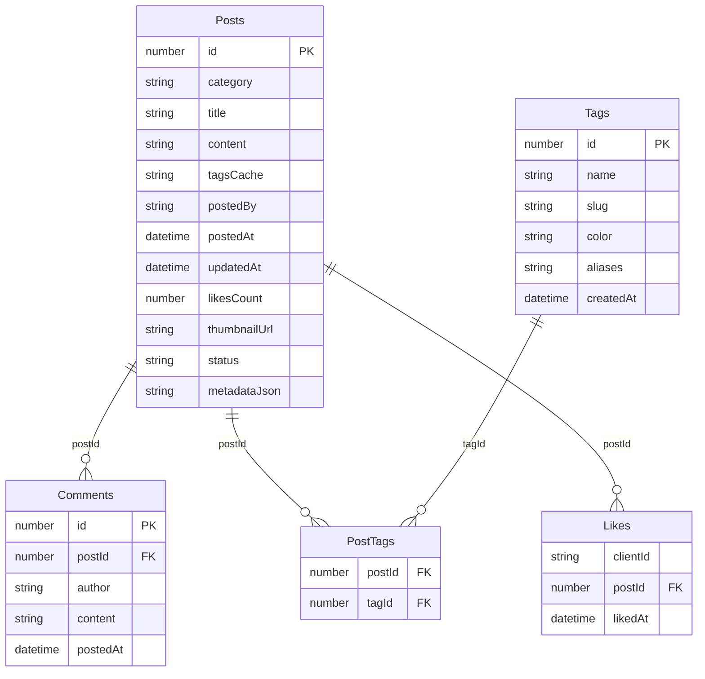
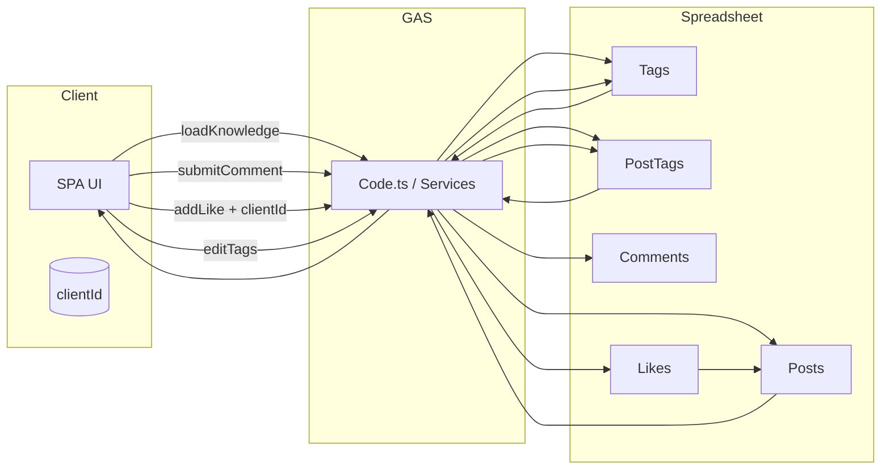

# AI Knowledge Dashboard スプレッドシート仕様書

## 1. 目的と前提

- 本書は「AI Knowledge Dashboard リニューアル計画」に沿って、Google スプレッドシートをデータベースとして再設計するための仕様をまとめたものです。
- URL ルーティングやカテゴリ別表示、タグマスター、いいね／お気に入り機能など、拡張された要件を支えるスキーマを定義します。
- 既存の 1 シート運用（`シート1`）から段階的に移行しやすいよう、**正規化しつつも GAS から扱いやすい粒度**を意識しています。

### 1.1 想定済みのユースケース

- `?page=...` / `?id=...` といった Deep Linking による画面遷移。
- カテゴリ（記事/質問/仲間募集/成果物）ごとに異なる入力項目・表示。
- Markdown ベースの本文、タグ検索、お気に入りフィルタ。
- コメントの履歴表示と追記、いいねの多重防止・再集計。

---

## 2. 全体構成

- **Posts** を中心に、タグ・コメント・いいねを各シートに分離。
- タグ候補は Tags シートで集中管理し、`PostTags` で中間テーブルを再現。
- いいねはユーザー認証がない前提のため、`clientId` を LocalStorage などで生成し、それをキーとして管理（ブラウザごとに一意）。

---

## 3. シート別仕様

### 3.1 `Posts` シート（メイン）

| 列  | ヘッダー       | 型 / 例                                    | 説明                                                                         |
| --- | -------------- | ------------------------------------------ | ---------------------------------------------------------------------------- |
| A   | `id`           | 数値 / `101`                               | 投稿の一意 ID。既存データ移行時は連番を維持。                                |
| B   | `category`     | 文字列 / `article`                         | `article`, `question`, `recruitment`, `showcase` のいずれか。                |
| C   | `title`        | 文字列                                     | タイトル。                                                                   |
| D   | `content`      | Markdown                                   | 詳細本文。                                                                   |
| E   | `tagsCache`    | JSON 配列 or カンマ区切り                  | 表示高速化用にタグ名を保持。正規情報は `PostTags`。                          |
| F   | `postedBy`     | 文字列                                     | 投稿者名。                                                                   |
| G   | `postedAt`     | 日時                                       | 投稿日。                                                                     |
| H   | `updatedAt`    | 日時                                       | 最終更新日時。                                                               |
| I   | `likesCount`   | 数値                                       | いいね数キャッシュ。`Likes` から集計するが、一覧描画高速化のために冗長保持。 |
| J   | `thumbnailUrl` | URL                                        | サムネイル。                                                                 |
| K   | `status`       | 文字列 / `open`, `closed`, `resolved` etc. | カテゴリ共通 or 特有の状態。                                                 |
| L   | `metadataJson` | JSON                                       | カテゴリ固有項目。例： `{"summary":"...", "questionDeadline":"2024-02-01"}`  |

> 備考: `metadataJson` は各カテゴリに必要なフィールドを柔軟に追加できる。GAS 側で `JSON.parse` してフォームや表示に反映する。

### 3.2 `Tags` シート（マスター）

| 列  | ヘッダー    | 例                 | 説明                                                         |
| --- | ----------- | ------------------ | ------------------------------------------------------------ |
| A   | `id`        | `10`               | タグ ID（連番）。                                            |
| B   | `name`      | `GAS`              | 表示名。                                                     |
| C   | `slug`      | `gas`              | URL/検索用に半角小文字へ正規化。                             |
| D   | `color`     | `#667eea`          | 表示用カラー。任意。                                         |
| E   | `aliases`   | `Apps Script, GAS` | カンマ区切りまたは JSON 配列。タグ入力時のサジェストに利用。 |
| F   | `createdAt` | 2024/01/01         | 作成日時。                                                   |

### 3.3 `PostTags` シート（中間）

| 列  | ヘッダー    | 説明                 |
| --- | ----------- | -------------------- |
| A   | `postId`    | `Posts.id` への FK。 |
| B   | `tagId`     | `Tags.id` への FK。  |
| C   | `createdAt` | 紐づけ日時（任意）。 |

フロントの入力では、タグ名 -> `Tags` レコードを検索または新規追加し、`PostTags` を更新する流れになる。

### 3.4 `Comments` シート

| 列  | ヘッダー   | 例       | 説明                  |
| --- | ---------- | -------- | --------------------- |
| A   | `id`       | `5001`   | コメント ID（連番）。 |
| B   | `postId`   | `101`    | 紐づく投稿 ID。       |
| C   | `author`   | `Taro`   | コメント投稿者。      |
| D   | `content`  | Markdown | コメント本文。        |
| E   | `postedAt` | 日時     | 投稿日。              |

> 既存の JSON 形式コメント履歴から移行する際は、`KnowledgeService.parseComments` の処理を流用し、それぞれのコメントを 1 行に展開する。

### 3.5 `Likes` シート

| 列  | ヘッダー   | 例          | 説明                           |
| --- | ---------- | ----------- | ------------------------------ |
| A   | `clientId` | `7f3c2d...` | ブラウザごとに生成した識別子。 |
| B   | `postId`   | `101`       | 紐づく投稿 ID。                |
| C   | `likedAt`  | 日時        | いいね日時。                   |

- クライアントは LocalStorage に `clientId`（UUID）を保持し、いいね時に送信。
- サーバーは `Likes` シートで `(clientId, postId)` 重複をチェックし、未存在なら挿入＋`Posts.likesCount` をインクリメント。

---

## 4. データフローと責務

- **読み込み**: `KnowledgeService.getList` は `Posts` を基点に、`PostTags` と `Tags` を join してタグ配列を構築。初期ロード時は SSR 的に `initialData` へ埋め込み。
- **書き込み**: 投稿追加・更新時に `Posts` と `PostTags` をまとめて更新。カテゴリ固有値は `metadataJson` へシリアライズ。
- **コメント**: `Comments` へ追記後、必要なら `Posts.updatedAt` を更新し、キャッシュをクリア。
- **いいね**: `Likes` へ重複チェック付きで挿入し、`Posts.likesCount` を再計算 or インクリメント。

---

## 5. 移行および実装ポインタ

1. **シート作成**: 既存ブックに `Posts`, `Tags`, `PostTags`, `Comments`, `Likes` を追加。ヘッダー行だけ先置きする。
2. **データ移行スクリプト**:
   - 旧 `シート1` から `Posts` を生成（列マッピング）。
   - コメント JSON を `Comments` に展開。
   - 既存タグ文字列を分割し、`Tags`（重複排除）と `PostTags` に投入。
   - `likes` 列の値を `Posts.likesCount` へ移し、`Likes` は空で開始（将来追記）。
3. **サービス層改修**:
   - `KnowledgeService` を各シートに対応するメソッドへ分割（例：`PostsRepository`, `CommentsRepository` 的クラス化も検討）。
   - キャッシュキーは `Posts` だけでなく、`Tags` 変更時にも無効化されるようにする。
4. **タグ入力 UI**:
   - `Tags` シートから候補リストを取得し、入力補助（オートコンプリート）を実装。
   - 新規タグが入力された場合は `Tags` に追記し、`PostTags` を作成。

---

## 6. 今後の拡張余地

- **ステータス履歴**: `StatusHistory` シートを追加すれば、質問や募集の進行ログを残せる。
- **カテゴリ固有ビュー**: `metadataJson` の項目設計をカテゴリごとの TypeScript 型に落とし込み、フォームを型安全に実装。
- **監査ログ**: GAS 実行ログとは別に、`ActivityLog` シートで CRUD の履歴を記録すれば、運用時の追跡が容易になる。

---

この仕様に従ってシートを整備することで、URL ルーティングや Notion ライクな UI を安定して実装できる基盤を整えられます。実装・移行の順序やスクリプトの詳細が必要になったら、次のタスクとして仕様追加できます。
